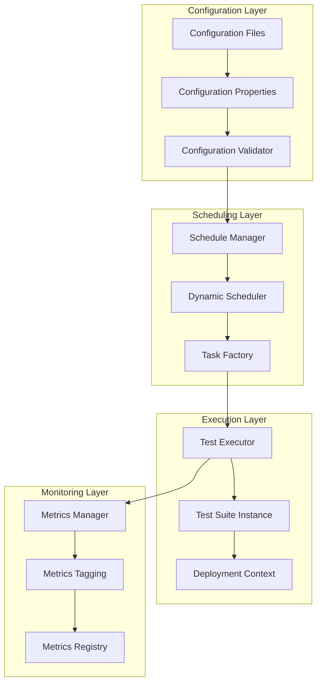
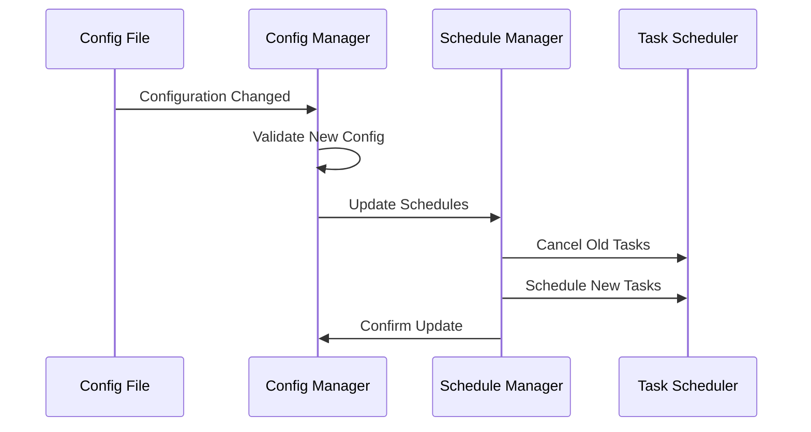

# Design Document

## Overview

This design transforms the OTP smoke testing system from a hardcoded, single-deployment architecture to a flexible, multi-deployment configuration-driven system. The new architecture will support:

- External configuration of multiple OTP deployments
- Flexible mapping of test suites to deployments
- Independent scheduling per test suite per deployment
- Enhanced metrics with deployment-specific tagging

The design leverages Spring Boot's configuration properties, dynamic scheduling capabilities, and maintains the existing JUnit-based test execution framework.

## Architecture

### High-Level Architecture



### Component Relationships

The system follows a layered architecture where:
1. **Configuration Layer** manages external configuration loading and validation
2. **Scheduling Layer** handles dynamic task scheduling and management
3. **Execution Layer** runs test suites with deployment-specific context
4. **Monitoring Layer** provides enhanced metrics with deployment tagging

## Components and Interfaces

### 1. Configuration Management

#### DeploymentConfiguration
```java
@ConfigurationProperties("otp.deployments")
public class DeploymentConfiguration {
    private Map<String, DeploymentConfig> deployments = new HashMap<>();
    
    public static class DeploymentConfig {
        private String name;
        private String otpUrl;
        private List<TestSuiteConfig> testSuites = new ArrayList<>();
    }
    
    public static class TestSuiteConfig {
        private String className;
        private String schedule; // Cron expression or simple interval
        private boolean enabled = true;
    }
}
```

#### Configuration File Format (YAML)
```yaml
otp:
  deployments:
    sound-transit:
      name: "SoundTransit"
      otp-url: "https://sound-transit-otp.ibi-transit.com"
      test-suites:
        - class-name: "com.arcadis.otpsmoketests.tests.SoundTransitTestSuite"
          schedule: "0 */10 * * * *"  # Every 10 minutes
          enabled: true
    hopelink:
      name: "Hopelink"
      otp-url: "https://hopelink-otp.ibi-transit.com"
      test-suites:
        - class-name: "com.arcadis.otpsmoketests.tests.HopeLinkTestSuite"
          schedule: "0 */15 * * * *"  # Every 15 minutes
          enabled: true
        - class-name: "com.arcadis.otpsmoketests.tests.SoundTransitTestSuite"
          schedule: "0 0 */2 * * *"   # Every 2 hours
          enabled: true
```

### 2. Dynamic Scheduling System

#### ScheduleManager
```java
@Component
public class ScheduleManager {
    private final TaskScheduler taskScheduler;
    private final TestExecutorFactory testExecutorFactory;
    private final Map<String, ScheduledFuture<?>> scheduledTasks = new ConcurrentHashMap<>();
    
    public void scheduleTestSuite(String deploymentName, DeploymentConfig deployment, 
                                 TestSuiteConfig testSuiteConfig);
    public void rescheduleAll(DeploymentConfiguration config);
    public void cancelScheduledTask(String taskId);
    public Set<String> getActiveSchedules();
}
```

#### TestExecutorFactory
```java
@Component
public class TestExecutorFactory {
    public TestSuiteExecutor createExecutor(String deploymentName, 
                                           DeploymentConfig deployment,
                                           TestSuiteConfig testSuiteConfig);
}
```

### 3. Enhanced Test Suite Architecture

#### DeploymentContext
```java
public class DeploymentContext {
    private final String deploymentName;
    private final String otpUrl;
    
    // Getters and utility methods
}
```

#### ConfigurableBaseTestSuite
```java
public abstract class ConfigurableBaseTestSuite extends BaseTestSuite {
    protected ConfigurableBaseTestSuite(DeploymentContext deploymentContext, 
                                       String geocodingUrl, double focusLat, double focusLon) {
        super(
            deploymentContext.getDeploymentName(),
            deploymentContext.getOtpUrl(),
            geocodingUrl,
            focusLat,
            focusLon
        );
    }
}
```

#### TestSuiteExecutor
```java
public class TestSuiteExecutor {
    private final String deploymentName;
    private final Class<?> testSuiteClass;
    private final DeploymentContext deploymentContext;
    private final MeterRegistry meterRegistry;
    
    public TestExecutionResult executeTests();
    private Object createTestSuiteInstance();
}
```

### 4. Enhanced Metrics System

#### DeploymentMetricsManager
```java
@Component
public class DeploymentMetricsManager {
    private final MeterRegistry meterRegistry;
    
    public void recordTestExecution(String deploymentName, String testSuiteName, 
                                   TestExecutionSummary summary);
    public void recordTestFailure(String deploymentName, String testSuiteName, 
                                 String testName, Throwable error);
    public Timer.Sample startTestTimer(String deploymentName, String testSuiteName);
}
```

#### Metric Naming Convention
- `otp.tests.{deploymentName}.{testSuiteName}.total`
- `otp.tests.{deploymentName}.{testSuiteName}.failures`
- `otp.tests.{deploymentName}.{testSuiteName}.duration`
- `otp.plan.requests.{deploymentName}.{testSuiteName}.duration`

## Data Models

### Configuration Data Model
```java
// Root configuration
DeploymentConfiguration
├── Map<String, DeploymentConfig> deployments
    └── DeploymentConfig
        ├── String name
        ├── String otpUrl
        └── List<TestSuiteConfig> testSuites
            └── TestSuiteConfig
                ├── String className
                ├── String schedule
                └── boolean enabled
```

### Runtime Data Model
```java
// Runtime execution context
TestExecutionContext
├── String deploymentName
├── DeploymentConfig deployment
├── TestSuiteConfig testSuiteConfig
├── Class<?> testSuiteClass
└── DeploymentContext deploymentContext
```

## Error Handling

### Configuration Validation
1. **Deployment Validation**
   - Validate required fields (name, otpUrl)
   - Validate URL formats
   - Check for duplicate deployment names

2. **Test Suite Validation**
   - Validate class names exist and are loadable
   - Validate schedule expressions (cron or interval format)
   - Check for circular dependencies

3. **Runtime Validation**
   - Validate deployment connectivity before scheduling
   - Handle test suite instantiation failures gracefully
   - Provide detailed error messages with context

### Error Recovery Strategies
1. **Configuration Errors**: Log errors and skip invalid deployments/test suites
2. **Scheduling Errors**: Retry with exponential backoff, fall back to default schedule
3. **Execution Errors**: Continue with other deployments, record failures in metrics
4. **Network Errors**: Implement circuit breaker pattern for deployment health checks

## Testing Strategy

### Unit Testing
1. **Configuration Loading Tests**
   - Test YAML parsing with valid/invalid configurations
   - Test configuration validation logic
   - Test default value handling

2. **Scheduling Tests**
   - Test schedule parsing (cron expressions, intervals)
   - Test task scheduling and cancellation
   - Test schedule updates and rescheduling

3. **Execution Tests**
   - Test test suite instantiation with deployment context
   - Test metrics recording with deployment tags
   - Test error handling and recovery

### Integration Testing
1. **End-to-End Configuration Tests**
   - Test complete configuration loading and scheduling flow
   - Test multiple deployments with different schedules
   - Test configuration hot-reloading


### Performance Testing
1. **Scheduling Performance**
   - Test with large numbers of deployments and test suites
   - Test schedule update performance
   - Test concurrent execution handling

2. **Memory Usage**
   - Test memory usage with multiple scheduled tasks
   - Test cleanup of completed tasks
   - Test metrics memory overhead

## Migration Strategy

### Phase 1: Infrastructure Setup
1. Create configuration classes and validation
2. Implement dynamic scheduling system
3. Create enhanced metrics system

### Phase 2: Test Suite Refactoring
1. Update existing test suites to use deployment context
2. Remove hardcoded deployment configurations
3. Update metrics to include deployment tags

### Phase 3: Configuration and Deployment
1. Create configuration files for existing deployments
2. Test with all deployments
3. Validate metrics and monitoring
4. Deploy and monitor

## Configuration Hot-Reloading

### Implementation Approach
1. **File Watching**: Use Spring Boot's configuration refresh capabilities
2. **Change Detection**: Compare configuration versions and detect changes
3. **Graceful Updates**: Cancel old schedules and create new ones without interrupting running tests
4. **Validation**: Validate new configuration before applying changes

### Hot-Reload Process


## Security Considerations

1. **Configuration Security**
   - Validate URL formats in configuration
   - Validate test suite class names exist and are loadable

2. **Runtime Security**
   - Implement timeout limits for external calls
   - Basic validation of test suite classes before instantiation

## Performance Considerations

1. **Scheduling Efficiency**
   - Use efficient data structures for schedule management
   - Implement lazy loading for test suite classes
   - Optimize schedule calculation algorithms

2. **Memory Management**
   - Implement proper cleanup for completed tasks
   - Use weak references where appropriate
   - Monitor and limit concurrent test executions

3. **Metrics Performance**
   - Use efficient metric collection strategies
   - Implement metric aggregation where possible
   - Consider metric retention policies